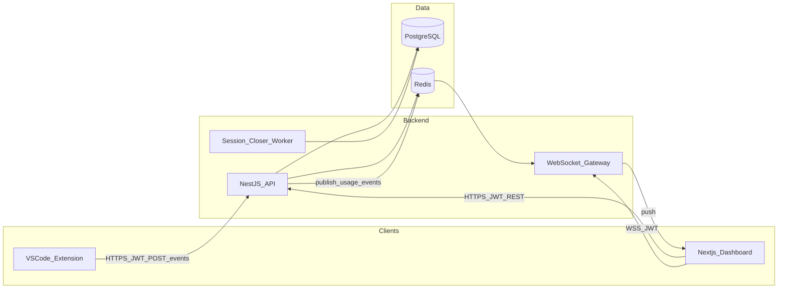

# Copilot Usage Tracker — Architecture

Privacy-first system for measuring GitHub Copilot Chat adoption, cost, and credit usage across a development team (20–100 developers, ~100k chat events/day).

## Purpose

Engineering leaders need to:

- See who uses Copilot and which models
- Estimate tokens and AI credits (not spy on prompt content)
- Attribute usage to tasks and sessions
- Optimize Copilot credit spend and prompt quality patterns

**Hard invariant:** Prompt text and source code never leave the developer machine. Only metadata is collected.

## System context



### Happy path

1. Extension captures Copilot Chat metadata and estimates tokens locally.
2. Batched `POST /events` with JWT → API validates, strips forbidden fields, re-estimates tokens/credits.
3. Persist event, touch/open session, upsert daily/monthly rollups.
4. Publish to Redis; WebSocket gateway fans out to RBAC-scoped rooms.
5. Dashboard merges deltas — no manual refresh.

## Locked defaults (v1)

| Decision | Choice |
|----------|--------|
| Tenancy | Single organization |
| Auth | GitHub OAuth (dashboard); device JWT for extension |
| Capture | Copilot Chat only; `kind` reserved for future completions |
| Credits | GitHub Copilot AI Credits only (USD/1M rates → credit = $0.01); Cursor = tokens only |
| Jira | Optional free-text / key on tasks; no Jira API |
| Aggregation | Sync rollup upsert on ingest |
| Realtime | NestJS WS + Redis pub/sub |

## Monorepo layout

```
ghc_token/
├── apps/
│   ├── api/                  # NestJS — application + adapters
│   ├── dashboard/            # Next.js + Tailwind + shadcn/ui + Recharts
│   └── vscode-extension/     # Capture + task commands + local estimator
├── packages/
│   ├── domain/               # Pure domain rules
│   ├── shared/               # DTOs, enums, Zod schemas
│   └── token-estimator/      # TokenEstimator + provider adapters
├── docker/
├── docs/
└── docker-compose.yml
```

### Dependency rule (Clean Architecture)

- `domain` / `token-estimator` → no Nest, Prisma, or React
- `api` → application services depend on ports; Prisma/Redis are adapters
- `dashboard` / `vscode-extension` → consume `shared` contracts only

## Bounded contexts

| Context | Responsibility |
|---------|----------------|
| Identity & Access | GitHub OAuth, JWT, roles (Admin / Leader / Developer) |
| Capture | Idempotent event ingest, privacy validation |
| Sessions | Open on first prompt; close on end or 30 min inactivity |
| Tasks | `/start` / `/end`; attach current task to events |
| Analytics | Filters, dashboard queries from rollups |
| Credits | Versioned estimation config |
| Realtime | Redis → WS rooms (`team`, `developer:{id}`) |

## Architecture Decision Records

See [adrs/](./adrs/):

- [ADR-001 Metadata-only capture](./adrs/001-metadata-only-capture.md)
- [ADR-002 Local + server token estimation](./adrs/002-token-estimation.md)
- [ADR-003 Hybrid session lifecycle](./adrs/003-session-lifecycle.md)
- [ADR-004 Redis pub/sub for realtime](./adrs/004-realtime-redis.md)
- [ADR-005 Sync rollups on write](./adrs/005-sync-rollups.md)
- [ADR-006 Auth model](./adrs/006-auth-model.md)
- [ADR-007 Docker Compose deployment](./adrs/007-docker-compose.md)

## Database

See [database.md](./database.md) for ER diagram, tables, and indexes (Phase 2).

## Security

- JWT on REST and WebSocket
- Row-level RBAC: Developers see self; Leaders see team; Admins see all
- Rate limit `POST /events` per developer/machine
- Zod validation; reject/strip unknown and forbidden fields
- No prompt/content columns in the schema

## Performance targets

| Target | Approach |
|--------|----------|
| API &lt; 200ms | Indexed writes, batch ingest, thin hot path |
| Dashboard &lt; 1s | Read from `daily_statistics` / `monthly_statistics` |
| Realtime | Push deltas; client-side merge |
| 100k events/day | Rollups + indexes; partition/archive as ops follow-up |

## Out of scope (v1)

- Multi-tenant SaaS
- Prompt/code content capture
- Live Jira sync
- Inline completion tracking (schema-ready via `kind`)
- Kubernetes / exact vendor invoice reconciliation
