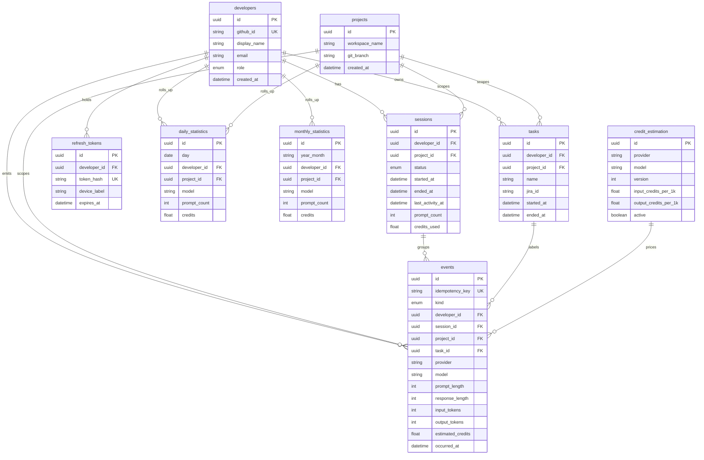

# Database design (Phase 2)

PostgreSQL schema for Copilot Usage Tracker. Prisma is the source of truth: [`apps/api/prisma/schema.prisma`](../../apps/api/prisma/schema.prisma).

## ER diagram

## Indexes

| Table | Index | Purpose |
|-------|-------|---------|
| events | `(occurred_at)` | Time-range scans |
| events | `(developer_id, occurred_at)` | Per-dev timeline |
| events | `(session_id)` | Session detail |
| events | `(task_id)` | Task cost |
| events | `(model, occurred_at)` | Model charts |
| events | `(idempotency_key)` unique | Safe retries |
| sessions | `(developer_id, status, last_activity_at)` | Inactivity worker |
| daily_statistics | unique `(day, developer_id, project_id, model)` | Upsert rollups |
| monthly_statistics | unique `(year_month, developer_id, project_id, model)` | Upsert rollups |
| credit_estimation | unique `(provider, model, version)` | Versioned rates |
| projects | unique `(workspace_name, git_branch)` | Dedupe projects |

## Privacy

No columns store prompt text, message bodies, or source code.
